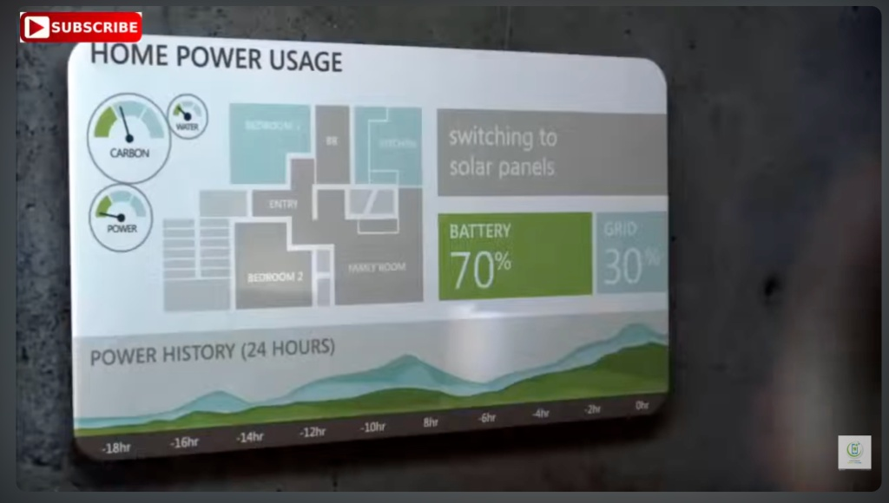

# Smart Panel: Generative Infographic Building Block

**Original Idea:**
- Event-driven situation (auto trigger on motion in doorbell camera)
- Voice-over listening: trigger by Hello Panel, listen to user request, then building infographic answer
- Web based by webcomponents.org
- context-aware on panel position, camera dock, question, and connected IoT devices: for example if it ask about today dinner, it could connect to camera inside fridger, and make recommendation
- Google ground-based
- Auto integrate MCP server
- Other features: can build cards of news or information and giving quick answer
- Panel can connect to TV, Smartphone, smart speaker, or Laptop; screen-aware rows number

- 